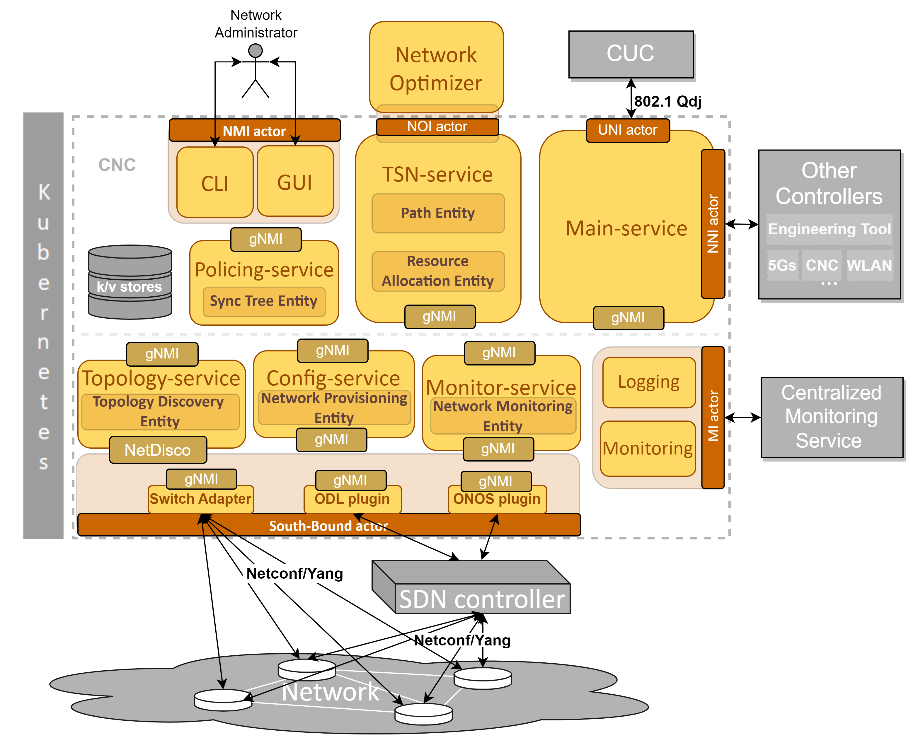
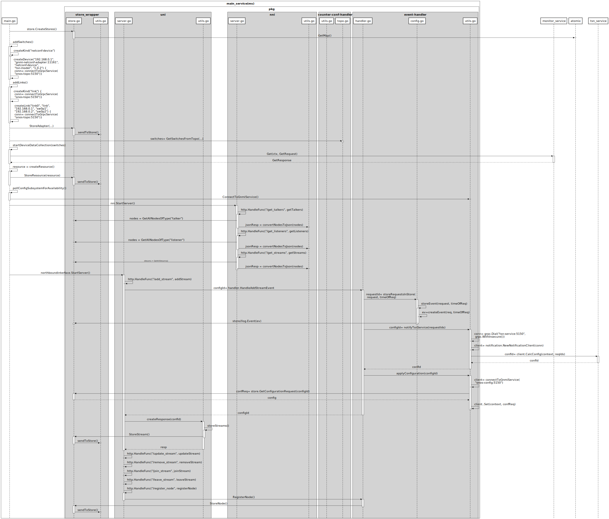

This repository is a microservice of the tool OpenCNC. OpenCNC is a unit that automatically manages the elements of a Time Sensitive Network (TSN) according to the specification presented in the IEEE 801.2Q standard and its relevant amendments.

For more information about OpenCNC, Links to the rest of its microservices as well the deployment script, please visit the repository [OpenCNC_demo: https://git.cs.kau.se/hamzchah/opencnc_demo.](https://git.cs.kau.se/hamzchah/opencnc_demo)

# Brief introduction of OpenCNC

OpenCNC is an implementation of the Control plane for TSN networks that orchestrates and manages the operations in the forwarding plane. The term management entails more than configuring
the network. It includes:
* Calculating the configuration of the TSN switches and the end stations.
* Loading and retrieving the configuration to/from the TSN switches automatically depending on the current state and target state of the network.
* Discovering the switches and retrieving their capabilities.
* Maintaining a global view of the topology and the available resources.
* Handling network events in order to maintain a desired state.
* Monitoring of performance key values for network analysis.

OpenCNC is designed as a micro-service based system. In total, it has the following micro-services, each micro-service is implemented in a different repository to allow easier use, extension and maintenance of the tool:
* Main service (current repository)
* TSN service
* policing service (not implemented yet)
* Monitoring interface
* Monitor service
* Topology service
* Config service
* gnmi to Netconf adapter
* Onos plugin (not implemented yet)

an overview of the OpenCNC target architecture is presented in the following Figure:

# Main-service
The main service does not establish any configuration. Rather, it plays two main roles. First it control the configuration processes. Second, it manages the information exchange with other network entities (this does not include the data streaming enabled by the monitoring interface). Therefore, this service is replacing the human network administrator in legacy networks. The main functionality of this services includes:

* Perform the OpenCNC initialization, including creating the stores, booting up the services, reading/writing/storing the initial network configuration.
* Communicate through the user-network interface (UNI) to receive requests and send responses.
* Validate the requests coming from the UNI.
* Orchestrate operations for handling user requests (join/leave stream)
* Decide about incoming streams’ admission/rejection.
* Manage streams in the data store (register new flows, delete obsolete, clean BD)
* Receive and process the administrator command, generated by the network management interface (NMI)
* Exchange control data with other network management entities through the network-network interface (NNI)

## Reference design of the main service
The target design of the main service is depicted in the following figure: 

The core packages of the main service are the management entity and the event-handler. Each of them expresses a different mode of functioning. The event handler  is reponsible for the event-driven processes such as receiving a new request from the uni. While, the management entity is responsible for the routine processes such as OpenCNC initialization. The other packages includes the UNI and the NNI:\
The UNI implements the user-network communication between the CNC and the CUC
as standardized by the 802.1Qdj standard amendment. In its current design the UNI offers the following functionalities:
* Add stream/streamList (implemented as a web  interface with a json body. an example of request and response files are available under the examples/ folder): receives an add stream request, calculate the configuration for it, do the admission control reserve the resources for it and returns a status group detailing the needed configuration in the talker and the listener nodes.
* Remove stream/streamList (the option is available but the process behind it is not implemented yet): withdraw a stream or list of streams.
* Update stream (the option is available but the process behind it is not implemented yet): updates a stream
* Join Listener (the option is available but the process behind it is not implemented yet): add a listener to a pre-configured stream
* Leave Listener(the option is available but the process behind it is not implemented yet): detach a listener from a stream
* register node (an example of the register json is available under the examples/ folder): register a talker or a listener

The NNI is designed to provide information to other network entities, i.e. in the context of inter-domain, inter-technology orchestration etc. Although, this interface is not part of the 802.1Q standard, it does not conflict with the standard and it could be a possible extension to it that could provide useful functionalities. In its current design the NNI offers the following functionalities:
* get talkers (implemented): returns all the registered talkers
* get listeners (implemented): return the registered listeners
* probe configuration request (not implemented): allows the user to get an idea about the performance that the network can provide if a add_stream is requested through the UNI, but without resource reservation.
* get streams data (partially implemented): returns information about the streams scheduled in the network
* get topology data (not implemented): returns information about the physical topology as Networkx graph describing the interconnection between the entities as well as their attributes.
* get performance data (not implemented): returns a performance matrix summarizing the aggregated or per talker-listener pairs KPIs such as delay, packet drop, jitter etc.
* get configuration (not implemented): returns the routing_matrix, the configured schedules, the priority configuration etc.

## Implementation State
the following sequence diagram summarizes the current state of implementation. Only the main functions are presented. for more details refer to the code itself.

.

The sequence diagram presents only the packages that are involved in one of the implemented processes. Nevertheless, more packages (representing modules or sub-modules of the reference design) are present in the code.

### TODO
#### Integrate the management entity and Extend the initialization processes
the initialization of the OpenCNC in the current state is performed in the main.go. those function needs to be placed in the management entity. Besides, following processes are missing:
* initiate the Topology discovery (the actual topology discovery is part of the topology-service) and information fetching (i.e. Managed objects(mandatory&optional) and counters of bridges and ports)
* Establish network state:
  * State: links states(up/down), bridges states((active/idle/lost),State: links states(up/down), bridges states((active/idle/lost),ports states
  * Characteristics of bridges, ports and links: inventoryInfo & portSpeed, model(hd,fd), mac-address, IP-address,numberOfQueues, MaximumTransmissionUnit, TrafficClass-MTUmapping, TrafficClass-queue mapping & propagation delay in both direction
  * Capabilities of bridges and ports: e.g. supported protocols, vlan related, priority related, InterfaceCapabilities
* Perform standby configuration
* Generate monitor config file…
* start regular monitoring:
  * Build/read configuration files: metricsConfig & monitoringModes
  * Initiate monitoring routine (the actual operation is part of the monitor-service to Analyze counters to metrics)
  * Initiate events detection and notification (the actual operation is part of the monitor-service to compare to threshold and notify).
  * Start Kafka streaming of counters and metrics (currently done manually)
* Resource characterization
   * Collect information about resources (bandwidth, queuing and latency). Currently, partially done in counter-monitor-conf
   * Compile a model for resource budgets and store it in the k/v store: the counters get attached to each interface on each switch. Currently, the counters must be manually added, interface-wise, in the file metricsConfig.
* Data-store maintenance
  * Cleaning
  * Check the state of the streams
  * Detect streams characteristics

#### Add the administrator management commands through CLI and GUI
currently there is no external control over OpenCNC once started. it does only the implemented processes the way the are programmed.
#### Add the missing processes of the Event Handler
* Finish all the functionalities available through the UNI.
* Add the authentication processes with regards to the interactions with the external entities through the UNI and the NNI.
* Implement admission check:
  * Implement the check between resources and configuration to decide about admitting or rejecting streams.
  * Integrate the admission check in the add_stream request.

#### Add the coordinator
currently the requests through NNI are handled in the NNI and direct connection to the store wrapper is implemented without any checks.

#### Extend the NNI functionalities
The exact list of functionalities is not defined yet since this is related to the inter-domain, inter-technology controller communication.

#### Implement the authentication service and processes
#### Add the store handler: cleans the data store from obsolete information

### Problems
#### Counter-monitor-conf:
- Naming convention
    - With current implementation, each counter (counter_conf:config:interval:counters:name:) must have a unique name.
    - The counter name must include the name of the counter defined in the yang file.

### More information about the existing modules

#### Configuration Handler

- Admission control
    - **AdmissionCheck(string, string) (bool, error)** - The function takes in the IP-address and a configuration ID, retrieves the resources of the switch and gets the configuration. After that it is supposed to check if the new configuration can be applied given the available resources for the switch. Finally it returns a boolean indicating either an accepted or denied configuration.
    - **StartSubscription(client.Type, []client.Path)** - The function takes in a query type and the paths that the query is requesting. It then subscribes to the monitor-service for the paths in the query.
- Config metadata generation
    - Structs:
        - Found under `/pkg/counter-conf-handler/types.go` and are used when unmarshaling the yaml counter configuration file
        - Counters
            - Name string
            - Path string
        - Config
            - Interval int
        - Counters []Counters
            - Counter_conf
            - Config []Config
- Read Counter file: \
    Read the counter config file and unmarshal it into a map. Returns a list of the struct Counter_conf defined in /counter-conf-handler/types.go
- Generate Switch monitor config: \
    Converts the struct into the correct format so that the configuration
can be applied
- Create Monitor Config: \
    Applies the configuration generated by genSwitchMonitorConfFromYAML and sends it to k/v store
- Store Wrapper
    - CreateStores()
    - LogEvent(*event.Event) (error)
    - StoreUniConfRequest(*configuration.Request) (*notification.UUID, error)
    - GetResponseData(string) (*configuration.ConfigResponse, error)
    - GetConfigurationRequest(string) (*pb.SetRequest, error)
    - GetResources(string) (*resources.Switch, error) - The function takes in a URN as a string, gets the resources of a switch stored in the k/v store at the URN, and finally returns the object containing the resources of the switch.
    - StoreMonitorConfig(*monitor.Config, string) (error)
    - StoreAdapter(string, string) (error)
    - StoreResource(resources.Switch) (error) - The function takes in a switch object containing its resources, then stores that object in the k/v store.

#### RAS, Resource Allocation Service
Resource Allocation Service (RAS) is to make changes to the configurations of the devices on the network.The functions that will be run is defined in the directory “ras”, and how it will communicate with the tsn-service, is defined in the directory notification.

##### pkg/RAS
The functions to change each part of the configuration. Each requirement has their own file, and each table their own function.

###### UpdateDefaultConfig() (err error)
Function to send an update request to TSN-service, to update the necessary configuration of the switches. response with an error that is not nil, if it failed.

##### pkg/structures/notification/
gRPC protocol buffer files for RAS.

#### gRPC (pkg/structures)
pkg/structures defines the gRPC protocol buffer structures that is used by this micro service. It can be read more about at the official [gRPC manual](https://developers.google.com/protocol-buffers/docs/gotutorial).

##### Make changes to the proto files
To communicate between the micro services, one needs to implement the interfaces with proto files under /configuration. The proto file needs to be identical between the services that will communicate with each other, and every time a change is done on the proto file, it needs to be recompiled.

##### Installation for proto
On every device, install the following packages for grpc go [source](https://grpc.io/docs/languages/go/quickstart/#prerequisites):
`$ go install google.golang.org/protobuf/cmd/protoc-gen-go@v1.28`
`$ go install google.golang.org/grpc/cmd/protoc-gen-go-grpc@v1.2`

##### Setup proto
On every service that will communicate with the proto files, set the PATH
`$ export PATH="$PATH:$(go env GOPATH)/bin"`

##### Compile Proto
 each time a change is done on the proto file, recompile it, in the folder where the proto file is located:
`$ protoc --go_out=. --go-grpc_out=. --go_opt=paths=source_relative --go-grpc_opt=paths=source_relative filename.proto`
If one do only want to compile the structures:
`$ protoc --go_out=. --go_opt=paths=source_relative filename.proto`

###### /notification
gRPC protocol buffer structures for RAS (Resource Allocation Service), whose role is to connect other services to the local RAE (Resource Allocation Entity). server.go defines the RAS notification Services functionality.
